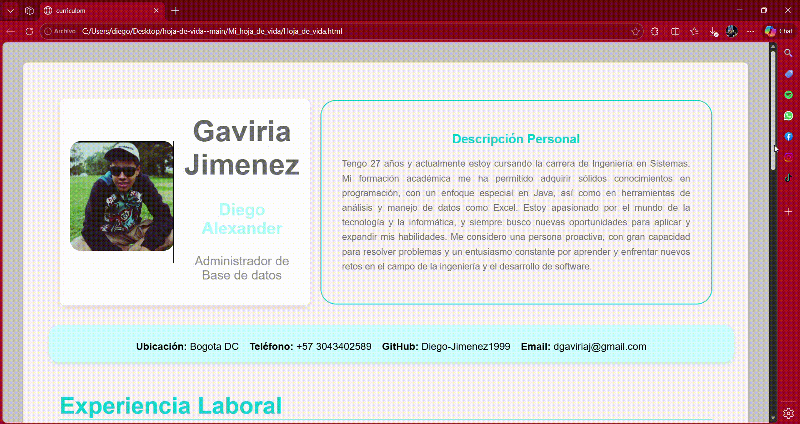

# Hoja de Vida Web

Proyecto de hoja de vida desarrollado con HTML y CSS como parte de mi portafolio de desarrollador.

## Demo

Ver proyecto online:
https://tuusuario.github.io/hoja-de-vida

## Vista previa

## Tecnologías utilizadas

- HTML5
- CSS3
- JavaScript

## Características

- Diseño limpio y moderno
- Estructura responsive
- Información profesional organizada
- Código simple y fácil de mantener

## Instalación

Clonar el repositorio:

git clone https://github.com/Diego-Jimenez1999/hoja-de-vida.git

Abrir el archivo:

index.html

## Autor

Diego Jiménez  
Estudiante de Ingeniería de Sistemas
